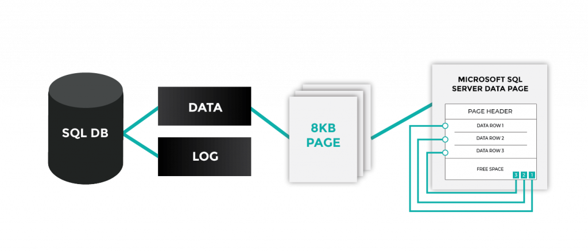
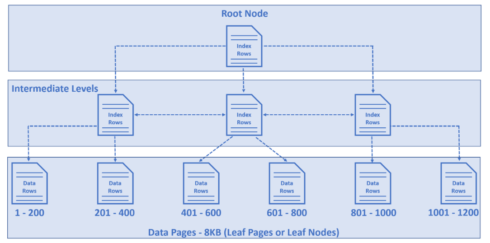
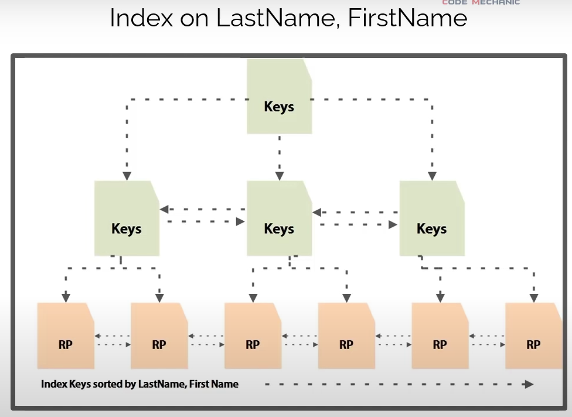

## 1. Cách tổ chức dữ liệu trong một bảng của Microsoft SQL Server

Như chúng ta đã biết, về mặt logic, SQL Server lưu các hàng dữ liệu dưới dạng bảng (table), nhưng về mặt vật lý, dữ liệu được chia thành các trang (data page), trong đó có chứa các hàng dữ liệu.

Mỗi data page có kích thước cố định là 8KB, do đó kích thước tối đa của mỗi hàng là 8KB.

Ngay khi chúng ta tạo một ràng buộc khóa chính, SQL Server sẽ tổ chức các data page dưới dạng cây (cụ thể là B-Tree). 

Các node lá của cây là các data page của chúng ta. Data sẽ được mặc định sắp xếp theo khóa chính.

Các node phía trên gọi là index row, chứa một key và các con trỏ, trỏ tới các index row khác hoặc các data page.

## 2. Chỉ mục (Indexing)

Index là một cấu trúc dạng cây. Dữ liệu trong index được sắp xếp theo một hoặc vài cột trong bảng, giúp cho việc truy xuất dữ liệu được nhanh hơn.

Index gồm có 2 loại là clustered index và non-clustered index:

- Dạng cấu trúc cây được tạo ra mặc định khi tạo khóa chính ở phần 1 chính là một clustered index. Clustered index sẽ lưu trữ và sắp xếp các data page thực tế nên mỗi bảng sẽ chỉ có tối đa 1 clustered index.

- Non-clustered index tương tự clustered index nhưng không lưu các data page thực mà chỉ lưu các con trỏ tới các hàng (row pointer). Do đó chúng ta có thể tạo rất nhiều non-clustered index trong một bảng.

- Trong hình trên row pointer sẽ được chia cụm theo tiêu chí chúng ta đã dùng để indexing (LastName và FirstName)

*Nguồn tham khảo:* [How is data stored in sql database](https://www.pragimtech.com/blog/sql-optimization/how-is-data-stored-in-sql-database/)